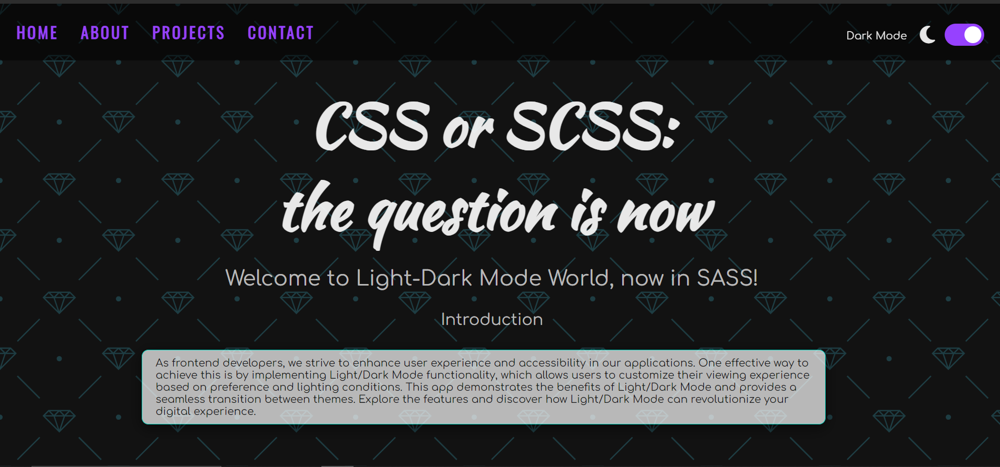

# SASSy Transition: Light-Dark-Mode-App Evolves with SASS Integration

## Elevating Style and Efficiency: Unleashing the Power of SASS for a Seamless Light-Dark Mode Experience in our CSS Legacy - Light-Dark-Mode-App!


You can check it out [here](https://d-vokic.github.io/Light-Dark-Mode-App-with-SASS-Integration-SASSy-Transition/ ).

## Author

👤 **Duško Vokić**

* LinkedIn: [Here](https://linkedin.com/in/duško-vokić-0337a2106)
* GitHub: [@D-vokic](https://github.com/D-vokic)

This project implements functionality for dynamically switching between Light and Dark modes on a web page. Using JavaScript and SCSS, users can easily toggle between different themes according to their preferences. It also includes support for local storage using localStorage, allowing the chosen theme to be remembered even after refreshing the page.

## Additional Details
1. **Customization Options:** Users have the flexibility to choose between light and dark themes based on their personal preferences and environmental conditions. This customization empowers users to tailor their browsing experience to suit their individual needs and preferences.
2. **User Experience Focus:** The project prioritizes user experience by allowing visitors to seamlessly switch between dark and light themes according to their preferences. This enhances readability and reduces eye strain, catering to a diverse audience with varying visual preferences.
3. **Responsive Design:** The theme switching functionality is implemented with a responsive design approach, ensuring that the user interface adapts smoothly across different screen sizes and devices. This makes the website accessible and visually appealing across a wide range of platforms.
4. **Accessibility Considerations:** Accessibility features are integrated into the design, ensuring that users with disabilities can navigate the website comfortably. This includes considerations for color contrast, keyboard navigation, and screen reader compatibility, fostering an inclusive browsing experience for all users.
5. **Local Storage Integration:** The project utilizes the browser's local storage capabilities to store the user's selected theme preference. This means that even if the user refreshes the page or navigates away, their chosen theme will persist, providing a consistent experience across sessions.
6. **Scalability and Maintenance:** The project is designed with scalability and maintainability in mind, allowing for easy integration of additional features and updates in the future. The codebase follows best practices and modular design principles, facilitating efficient maintenance and future enhancements.
7. **Documentation and Support:** Comprehensive documentation is provided to guide users and developers in understanding and extending the functionality of the project. Additionally, support channels are available to address any questions or issues that may arise during usage or development.

Overall, the project aims to enhance user satisfaction and engagement by offering a visually pleasing, accessible, and customizable browsing experience through dynamic theme switching.

### Overview
The project facilitates dynamic theme switching between dark and light modes on a web page. Users can toggle between different themes seamlessly, enhancing readability and user experience.

### Key Features
1. **Dynamic Theme Switching:** The project allows users to switch between dark and light themes dynamically. This feature enhances user experience by providing flexibility and customization options based on individual preferences and environmental conditions.
2. **Local Storage Integration:** User-selected themes are stored locally using localStorage. This ensures that the chosen theme persists even after the user refreshes the page or navigates away, providing a consistent browsing experience across sessions.
3. **Accessibility Considerations:** The project prioritizes accessibility by ensuring that the themes maintain readability and usability for all users, including those with visual impairments or other disabilities. Accessibility features such as color contrast and keyboard navigation are integrated to enhance inclusivity and usability.

### Usage
To use this project on GitHub, follow these steps:
1. **Clone the Repository:** Visit the GitHub repository hosting the project. Clone the repository to your local machine using Git. <p>Use the following command in your terminal:<br>
 ```git clone https://github.com/D-vokic/SASSy-Transition-Light-Dark-Mode-App-Evolves-with-SASS-Integration```</p>
2. **Set Up the Project:** Navigate to the project directory on your local machine. Ensure you have a web server environment set up, such as Apache or Nginx, or use a local development server like Live Server for VS Code.
3. **Include HTML, SCSS, and JavaScript Files:** Make sure you have the necessary HTML, SCSS, and JavaScript files in your project directory. These files should contain the code for the dynamic theme switching functionality, including the toggle switch, theme styles, and JavaScript functions.
4. **Customize and Extend:** Customize the project according to your requirements. You can modify the HTML structure, update CSS styles to match your design preferences, and extend JavaScript functionality as needed.
5. **Commit Changes:** <p>Once you've made modifications or customizations to the project, commit your changes using Git. Use the following commands:<br>
```git add .```<br>
```git commit -m "Description of changes"```</p>
1. Push Changes to GitHub: <p>Push your changes to the GitHub repository using the following command:<br>
```git push origin main```</p>
6. Publish on GitHub Pages (Optional): If you want to showcase your project online, you can publish it using GitHub Pages. Simply go to your repository's settings on GitHub, navigate to the "Pages" section, and choose the branch you want to publish (usually main). Once enabled, your project will be accessible via a GitHub Pages URL.
Troubleshooting:
1. **Common Issues and Solutions:**
> If you encounter any issues during installation or usage, refer to the troubleshooting section in the README.md file of the GitHub repository.
> Search for existing GitHub issues or open a new one to report bugs or request assistance from the developer community.
Conclusion:
Congratulations! You have successfully learned how to use the Light/Dark Mode App. Enjoy the flexibility and comfort of customizing your digital experience according to your preferences and lighting conditions.

Feel free to provide feedback, suggestions, or contribute to the project on GitHub to help improve the app for all users.

### Implementing Light/Dark Mode in Your Frontend Application: A Guide for GitHub Users
Implementing a light/dark mode feature in a frontend application involves a few key steps. Here's a high-level overview of how you can implement it:
1. **HTML Structure**
Ensure your HTML structure includes elements that you want to style differently based on the selected theme. This could include the entire page layout, text elements, buttons, images, etc.
2. **CSS Styling**
Define CSS styles for both light and dark themes. You can use CSS variables to define common properties and easily switch between themes by updating these variables.

3. **JavaScript Logic**
Use JavaScript to handle the theme switching functionality. This involves:

> Detecting User Preference: Determine whether the user has a preference stored in localStorage or use system/browser settings to detect their preference.

> Applying Theme: Apply the appropriate theme based on the user's preference. Update CSS classes or directly modify CSS properties to switch between light and dark themes.

> Updating Local Storage: Store the user's preference in localStorage to persist their choice across sessions.

4. **User Interaction**
Provide a user-friendly way for users to toggle between light and dark themes. This could be a toggle switch, a button, or any other interactive element.

5. **Testing and Optimization**
Test the implementation across different browsers and devices to ensure consistent behavior and appearance. Optimize the implementation for performance and accessibility, ensuring that the application remains usable for all users, including those with visual impairments.

**Example Code Snippet**
Here's a simplified example of how you can implement light/dark mode switching using HTML, CSS/SCSS, and JavaScript:

```HTML
<!DOCTYPE html>
<html lang="en">
<head>
    <meta charset="UTF-8">
    <meta name="viewport" content="width=device-width, initial-scale=1.0">
    <title>Light/Dark Mode</title>
    <link rel="stylesheet" href="assets/css/style.css">
</head>
<body>
    <!-- Dark Mode Switch starts-->
    <div class="theme-switch-wrapper">
      <span id="toggle-icon">
        <span class="toggle-text">Light Mode</span>
        <i class="fas fa-sun"></i>
      </span>
      <label class="theme-switch">
        <input type="checkbox" />
        <div class="slider round"></div>
      </label>
    </div>
    <!-- Dark Mode Switch ends-->
    <script src="assets/js/script.js"></script>
</body>
</html>
```
```SCSS
/* style.scss */
.theme-switch-wrapper {
    @include flex;
    z-index: 100;
    position: fixed;
    right: 25px;
    top: 30px;

    & span {
        margin-right: 10px;
        font-size: 1rem;

        .toggle-text {
            position: relative;
            top: -4px;
            right: 5px;
            color: var(--on-background);
        }

        & .fas {
            font-size: 30px;
            margin-right: 5px;
        }
    }
    /* Add more styles for dark mode */
}
```
```JavaScript
/**
 * @type {HTMLInputElement}
 */
const toggleSwitch = document.querySelector('input[type="checkbox"]');

/**
 * @type {HTMLElement}
 */
const toggleIcon = document.getElementById("toggle-icon");

/**
 * Switch Theme Dynamically
 * @param {Event} event - The event object.
 */
function switchTheme(event) {
  if (event.target.checked) {
    document.documentElement.setAttribute("data-theme", "dark");
    localStorage.setItem("theme", "dark");
    darkMode();
  } else {
    document.documentElement.setAttribute("data-theme", "light");
    localStorage.setItem("theme", "light");
    lightMode();
  }
}

/**
 * Event listener for the toggle switch change event.
 * @listens toggleSwitch:change
 */
toggleSwitch.addEventListener("change", switchTheme);

```
This is a basic implementation. You can extend it by adding more elements and styles to fit your application's design and requirements.

**Why Implement Light/Dark Mode?**
1. **Enhanced User Comfort:** Light/Dark Mode offers users the flexibility to choose a theme that suits their visual comfort, reducing eye strain and improving readability, particularly in low-light environments.
2. **Improved Accessibility:** Dark Mode can enhance accessibility for users with visual impairments or sensitivity to bright light, making content more readable and accessible to a wider audience.
3. Modern Aesthetic: Integrating Light/Dark Mode can elevate the aesthetic appeal of your frontend application, providing users with a sleek and modern interface design that enhances overall satisfaction.

**How to Implement Light/Dark Mode:**
1. **CSS/SCSS Variables and Media Queries:** Utilize CSS/SCSS variables and media queries to define color schemes and styles for both light and dark themes. This allows for easy switching between themes based on user preference or system settings.
2. **JavaScript and Theme Toggle:** Implement JavaScript to add functionality for toggling between light and dark themes. This may involve adding event listeners to buttons or switches that trigger theme changes dynamically.
3. **Storage and Persistence:** Consider using local storage or cookies to store user preferences for Light/Dark Mode, ensuring that their chosen theme persists across sessions and visits to your application.


### Integration
For GitHub users, especially frontend developers, integrating Light/Dark Mode functionality into applications offers enhanced user experience and accessibility. Frontend developers can leverage CSS/SCSS variables or preprocessors like Sass in this case to define theme-specific stylesheets and seamlessly switch between light and dark themes. Additionally, they can utilize JavaScript frameworks like React or Vue.js to dynamically update the UI based on user preferences or system settings, ensuring a smooth and responsive transition between modes. With proper documentation and version control through GitHub, developers can collaborate effectively and iteratively improve the Light/Dark Mode integration to meet user needs and preferences.

### Conclusion
Incorporating Light/Dark Mode functionality into your frontend applications not only enhances user experience and accessibility but also showcases your commitment to providing a modern and customizable interface. By following these implementation strategies, you can empower users to tailor their viewing experience while improving engagement and satisfaction with your application.

Remember to document your implementation process and encourage collaboration and feedback from the GitHub community to further enhance the usability and effectiveness of Light/Dark Mode in your frontend projects.

## Technologies and Languages

- HTML5
- CSS3
- SASS
- JavaScript
- Mixins
- @use rule
- @forward rule

## License

This project is licensed under the [MIT License](https://www.mit.edu/~amini/LICENSE.md).

## Contact Information

You can contact me via email: vokic.dusko@gmail.com
